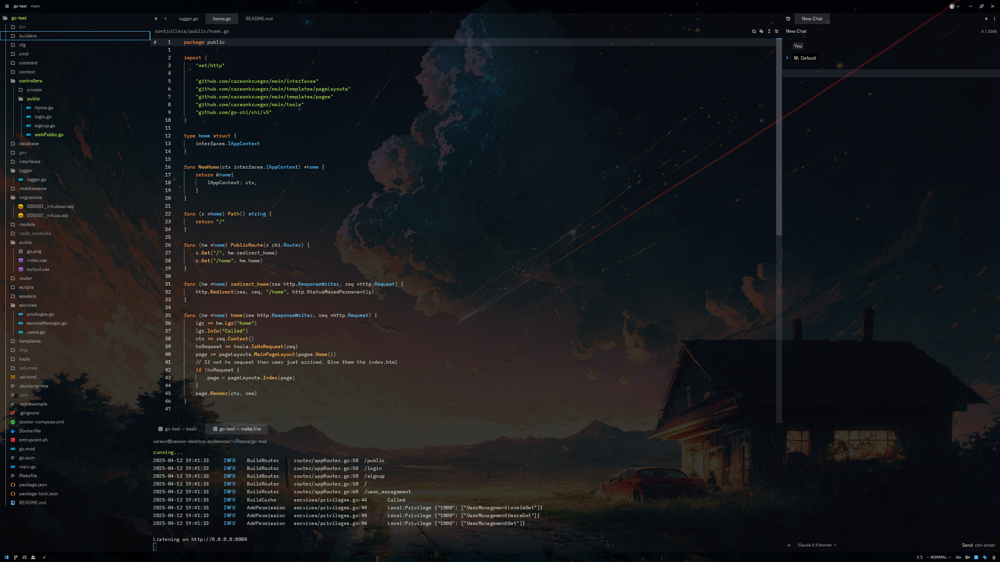

Here's a README.md for your Zed editor configuration:

# My Zed Editor Configuration

Personal configuration files for the [Zed Editor](https://zed.dev/), optimized for a clean, minimal development environment with Vim keybindings.

## Features

- **Theme**: Custom-modified Ayu Dark with transparent backgrounds
- **Vim Mode**: Enabled with relative line numbers
- **Font Sizes**: UI: 14px, Buffer: 12.5px
- **AI Assistant**: Configured with Claude 3 Sonnet
- **Custom Key Bindings**: Vim-friendly shortcuts for efficient navigation

## Key Bindings Highlights

- `space e` - Toggle Project Panel
- `space g` - Toggle Git Panel
- `space t` - Toggle Terminal
- `space a` - Toggle AI Assistant
- `tab` - Open Tab Switcher
- `[ [` / `] ]` - Swap tabs left/right
- `ctrl-k {h,j,k,l}` - Split pane controls

## Language-Specific Settings

- **Rust**: Inlay hints enabled
- **TypeScript/JavaScript**: Prettier disabled

## Visual Customizations

- Transparent/blurred backgrounds for panels and UI elements
- Custom scrollbar styling
- Modified active line and indent guide colors
- Active pane magnification: 1.5x

## Requirements

- "Colored Zed Icons Theme Dark" extension

## Notes

- Telemetry is disabled
- Project panel auto-folding is disabled
- Custom theme overrides for a transparent/minimal UI
